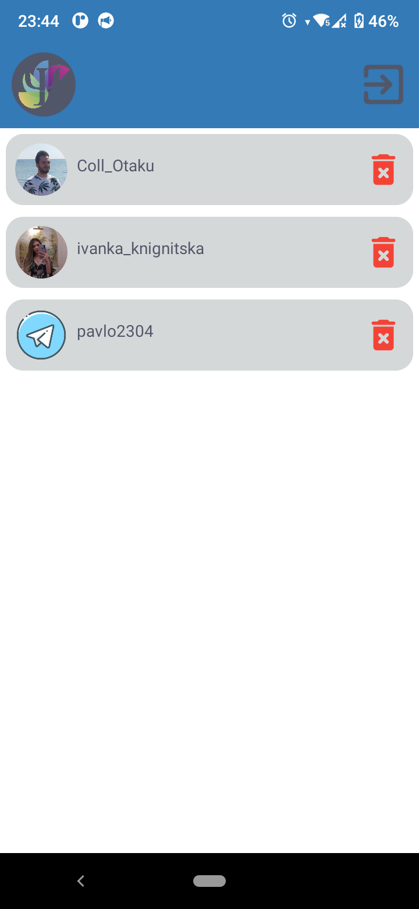
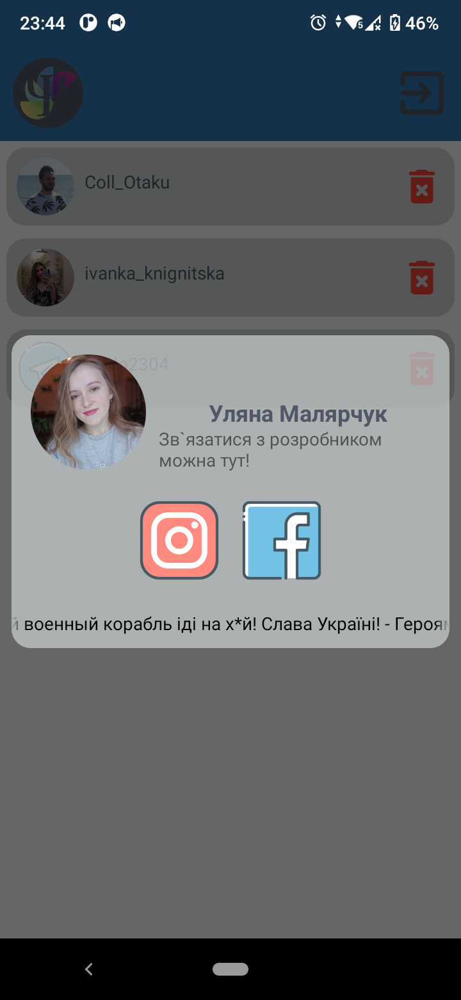
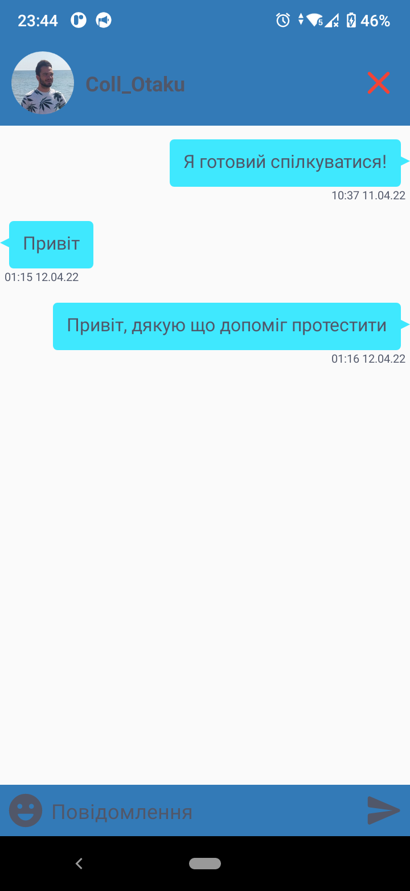
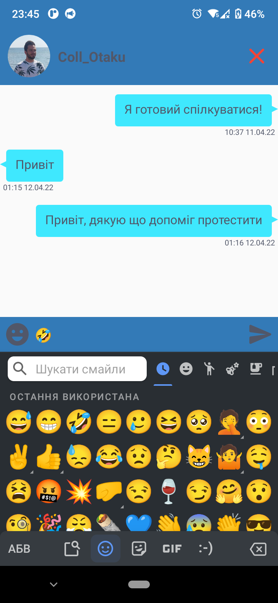
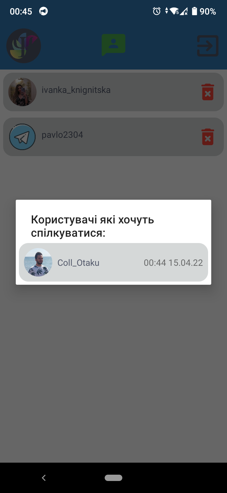
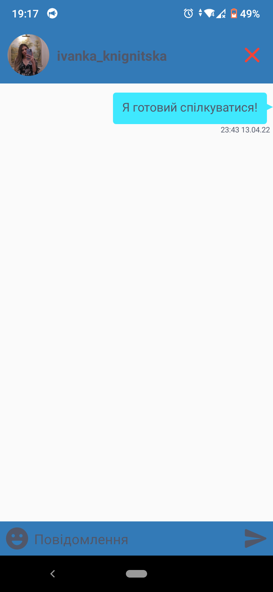

<p align="center"></p>
<h1 align="center">OnlinePsychologist</h1>

## Description
<b>EN:</b>

Ordered course work on the topic "Design and development of the software product «Chat-bot Psychologist»".

This is a mobile messenger app for psychologists that works through the **API** of the previous coursework ([online-psychologist.com](https://github.com/CoolOtaku/online-psychologist.com)).
It is also possible to communicate with the **Telegram** bot through it (that is, the client writes to the bot in **Telegram**, and the psychologist receives messages through the application and can reply).

In order for the application to cooperate with the [**Firebase**](https://firebase.google.com) service. Requires data from your [google-service-account.json](https://github.com/CoolOtaku/OnlinePsychologist/blob/main/app/google-services.json).

<b>UA:</b>

Замовлена курсова робота на тему "Проектування та розробка програмного продукту «Чат-бот Психолог»".

Це мобільний додаток месенджер для психологів, який працює через **API** попередньої курсової роботи ([online-psychologist.com](https://github.com/CoolOtaku/online-psychologist.com)). Також через нього можна спілкуватися з **Telegram** бота (тобто клієнт пише ботові в **Telegram**, а психолог через додаток отримує повідомлення та може відповісти).

Для того, щоб співпрацював додаток із сервісом [**Firebase**](https://firebase.google.com). Потрібні дані з вашого [google-service-account.json](https://github.com/CoolOtaku/OnlinePsychologist/blob/main/app/google-services.json).

#
## Screenshots:
<p>
  
  
  
  
  
  
  
</p>

#
## Technologies used
<b>EN:</b>
- Image caching and rendering via [**Picasso**](https://square.github.io/picasso/)
- Using [**Retrofit**](https://square.github.io/retrofit/) to communicate with the site's **API**
- Working with the **JSON** format parsing into a regular object
- Using the [**Firebase**](https://firebase.google.com) service to store and read data
- Using [**Firebase**](https://firebase.google.com) to send push notifications
- Sending messages to the **Telegram** bot, through the [**Telegram API**](https://core.telegram.org)
- Using the emoji keyboard ([**SuperNova-Emoji**](https://github.com/hani-momanii/SuperNova-Emoji))
- Using the element interface to display messages ([**BubbleLayout**](https://github.com/MasayukiSuda/BubbleLayout))
- Using the element interface to display a list of elements from an array ([**RecyclerView**](https://developer.android.com/reference/androidx/recyclerview/widget/RecyclerView))
- Authorization through **Google**

<b>UA:</b>
- Кешування та відображення зображення через [**Picasso**](https://square.github.io/picasso/)
- Використання [**Retrofit**](https://square.github.io/retrofit/) для спілкування з **API** сайту
- Робота з форматом **JSON** парсинг в звичайний об'єкт
- Використання служби [**Firebase**](https://firebase.google.com) для зберігання та читання даних
- Використання служби [**Firebase**](https://firebase.google.com) для надсилання push-сповіщення
- Надсилання повідомлень на **Telegram** бот, через [**Telegram API**](https://core.telegram.org)
- Використання клавіатури з емодзі ([**SuperNova-Emoji**](https://github.com/hani-momanii/SuperNova-Emoji))
- Використання інтерфейс елементу для відображення повідомлень ([**BubbleLayout**](https://github.com/MasayukiSuda/BubbleLayout))
- Використання інтерфейсу елемента для відображення списку елементів з масиву ([**RecyclerView**](https://developer.android.com/reference/androidx/recyclerview/widget/RecyclerView))
- Авторизація через **Google**

#
## License
```
© 2022, CoolOtaku (ericspz531@gmail.com)
```
